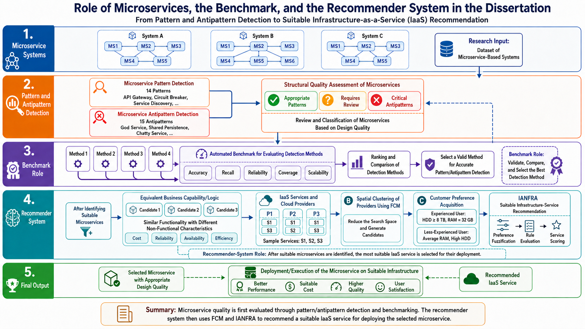
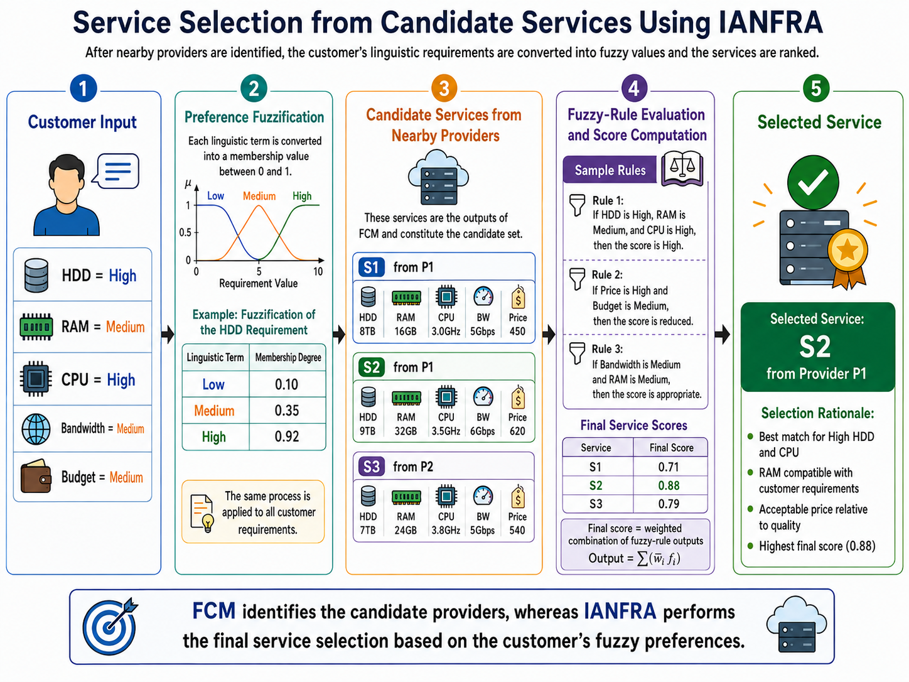
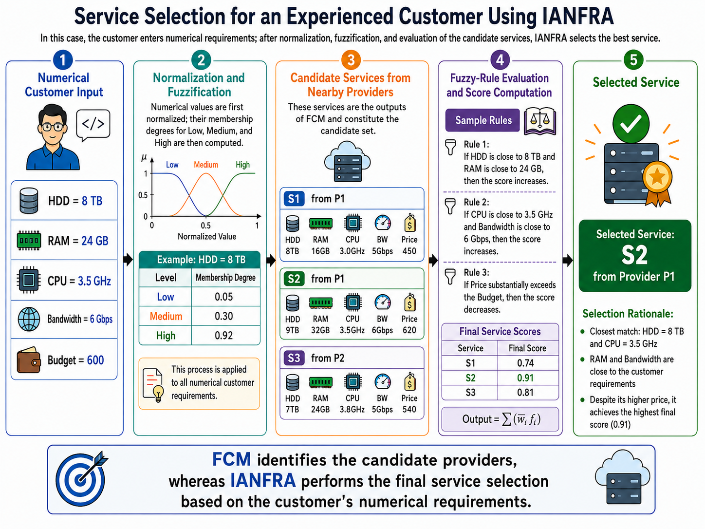

# Dissertation Supplementary Materials

This repository provides supplementary material for a doctoral dissertation on structural quality assessment and infrastructure recommendation for microservice-based systems. The research connects three concerns that are often studied separately: detection of microservice design patterns and antipatterns, benchmark-based evaluation of detection methods, and recommendation of a suitable Infrastructure-as-a-Service (IaaS) offering for deploying a selected microservice.

## Research workflow

The workflow begins with a dataset of microservice-based systems. Static-analysis artifacts—including service dependencies, annotations, imports, configuration files, and system structure—are used to detect architectural patterns and antipatterns. The resulting evidence supports a structural quality assessment of the candidate microservices. Detection methods are evaluated and compared through an automated benchmark, after which the selected high-quality microservices are passed to the infrastructure-recommendation stage.

The five stages shown in the figure are:

1. **Microservice systems.** A collection of microservice-based systems provides the research input and the architectural artifacts required for analysis.
2. **Pattern and antipattern detection.** Supported design patterns and antipatterns are identified, and the microservices are reviewed and classified according to their structural design quality.
3. **Benchmark-based evaluation.** Competing detection methods are assessed using accuracy, recall, reliability, coverage, and scalability. The benchmark validates, ranks, and compares the methods so that a suitable method can be selected for dependable pattern and antipattern detection.
4. **Infrastructure recommendation.** Microservices with equivalent business functionality may differ in non-functional characteristics such as cost, reliability, availability, and efficiency. Fuzzy C-Means (FCM) clustering reduces the cloud-provider search space, while customer preferences are processed by IANFRA to score candidate services and recommend a suitable IaaS option.
5. **Final output.** A microservice with appropriate design quality is deployed on a suitable infrastructure service, with the objective of improving performance, cost suitability, quality, and user satisfaction.

## IANFRA case studies

The following case studies illustrate how the recommendation stage handles two forms of customer requirements. In both cases, FCM first limits the search space to services offered by nearby cloud providers. IANFRA then evaluates the candidate services against the customer's preferences and returns the highest-scoring service.

### Case Study 1: Service selection from linguistic preferences

This case study represents a customer who specifies requirements through linguistic terms rather than exact numerical values: HDD and CPU are rated **High**, while RAM, bandwidth, and budget are rated **Medium**. Each linguistic term is mapped to fuzzy membership degrees. For example, the HDD requirement has membership degrees of 0.10, 0.35, and 0.92 for the Low, Medium, and High sets, respectively.

FCM supplies three candidate services: S1 and S2 from provider P1 and S3 from provider P2. IANFRA evaluates the candidates through fuzzy rules that capture the relationships among capacity, processing power, bandwidth, price, and the customer's budget. The final scores are 0.71 for S1, 0.88 for S2, and 0.79 for S3. Consequently, **S2 from provider P1** is selected because it provides the strongest match to the customer's high HDD and CPU preferences, offers compatible RAM, and achieves the highest overall score despite its higher price.

### Case Study 2: Service selection for an experienced customer

This case study represents an experienced customer who supplies precise numerical requirements: 8 TB HDD, 24 GB RAM, 3.5 GHz CPU, 6 Gbps bandwidth, and a budget of 600. The values are normalized to a common scale and then fuzzified into Low, Medium, and High membership degrees. For example, the normalized 8 TB HDD requirement has membership degrees of 0.05, 0.30, and 0.92 for the three fuzzy sets.

The same FCM-derived candidate set is evaluated using rules that reward proximity to the requested hardware and bandwidth while penalizing prices that exceed the stated budget. The resulting scores are 0.74 for S1, 0.91 for S2, and 0.81 for S3. **S2 from provider P1** is again selected: its CPU and bandwidth exactly match the requested values, its remaining resources are sufficiently close to the customer's requirements, and its final score remains the highest after the price penalty is considered.

| Comparison dimension | Case Study 1 | Case Study 2 |
| --- | --- | --- |
| Customer profile | Customer expressing qualitative preferences | Experienced customer providing precise requirements |
| Input representation | Linguistic terms: Low, Medium, and High | Numerical resource and budget values |
| Preprocessing | Direct fuzzification | Normalization followed by fuzzification |
| Candidate scores | S1: 0.71; S2: 0.88; S3: 0.79 | S1: 0.74; S2: 0.91; S3: 0.81 |
| Selected service | S2 from provider P1 | S2 from provider P1 |

## Supplementary appendix files

The dissertation refers to the following three supplementary LaTeX files. They are separated by purpose so that each appendix can be cited, reviewed, or included independently.

| File | Purpose |
| --- | --- |
|[`(anti)patterns-definition.pdf`](appendices/(anti)patterns-definition.pdf)| Defines the microservice design patterns and antipatterns examined in the dissertation, explains their architectural intent or quality risk, and states why they can be detected through static analysis. |
|  [`PDMs.pdf`](appendices/PDMs.pdf)  | Documents the two pattern-mining procedures: the Support Vector Machine (SVM) method and the graph-based method using node labeling, edge filtering, Dual Simulation, and global-constraint validation. |
| [`svm-feature-vector.pdf`](appendices/svm-feature-vector.pdf) | Gives the detailed definition and initialization of the 30-element SVM feature vector, including Master, Worker, and Client roles and the worked API Gateway subgraph example. |

<!--## Publications Resulting from the Dissertation

The following peer-reviewed publications constitute the principal scholarly outputs of this doctoral research:

1. “BenchPDM: Benchmarking Pattern Detection Methods in Microservice-Based Systems Using Automatically Generated Pattern-Assisted Testbeds,” *Empirical Software Engineering*, 2026. **JCR Q1; Impact Factor: 3.6.** Dissertation contribution: the proposed benchmarking approach.

2. “On the Engineering of Robust Microservice Architectures through Anti-Pattern Recognition,” *The Journal of Systems and Software*, 2026. **JCR Q1; Impact Factor: 4.1.** Dissertation contribution: the proposed pattern- and antipattern-detection approach.

3. “Cloud Broker: A Systematic Mapping Study,” *IEEE Transactions on Services Computing*, 2023. **JCR Q1; Impact Factor: 5.8.** Dissertation contribution: the systematic mapping study.

4. “A Two-Stage Location-Sensitive and User Preference-Aware Recommendation System,” *Expert Systems with Applications*, 2022. **JCR Q1; Impact Factor: 9.0.** Dissertation contribution: the proposed service-recommendation approach.

5. “A Pattern-Aware Design and Implementation Guideline for Microservice-Based Systems,” in *Proceedings of the 27th International Computer Conference, Computer Society of Iran (CSICC)*, Tehran, Iran, 2022. Dissertation contribution: analysis of microservice design patterns.-->

 ## Research Outputs and Publications

The research presented in this dissertation has resulted in, and has been supported by, the following peer-reviewed publications. These works address different components of the proposed research framework, including systematic analysis of cloud brokerage, microservice pattern and anti-pattern detection, benchmarking of pattern detection methods, service recommendation, and pattern-aware microservice design.

1. **“BenchPDM: Benchmarking Pattern Detection Methods in Microservice-Based Systems Using Automatically Generated Pattern-Assisted Testbeds.”**
   *Empirical Software Engineering*, 2026.
   **Contribution to the dissertation:** Benchmarking framework for evaluating pattern and anti-pattern detection methods.

2. **“On the Engineering of Robust Microservice Architectures through Anti-Pattern Recognition.”**
   *The Journal of Systems & Software*, 2026.
   **Contribution to the dissertation:** Proposed approach for detecting microservice architectural patterns and anti-patterns.

3. **“Cloud Broker: A Systematic Mapping Study.”**
   *IEEE Transactions on Services Computing*, 2023.
   **Contribution to the dissertation:** Systematic mapping study providing the theoretical foundation for cloud service brokerage and service selection.

4. **“A Two-Stage Location-Sensitive and User Preference-Aware Recommendation System.”**
   *Expert Systems with Applications*, 2022.
   **Contribution to the dissertation:** Service recommendation approach underlying the recommendation component of the proposed framework.

5. **“A Pattern-Aware Design and Implementation Guideline for Microservice-Based Systems.”**
   *27th International Computer Conference, Computer Society of Iran (CSICC), Tehran, Iran*, 2022.
   **Contribution to the dissertation:** Analysis of microservice patterns and pattern-aware design principles.

These publications collectively provide the theoretical foundations, methodological components, empirical evaluations, and supporting techniques developed and integrated within the dissertation.

